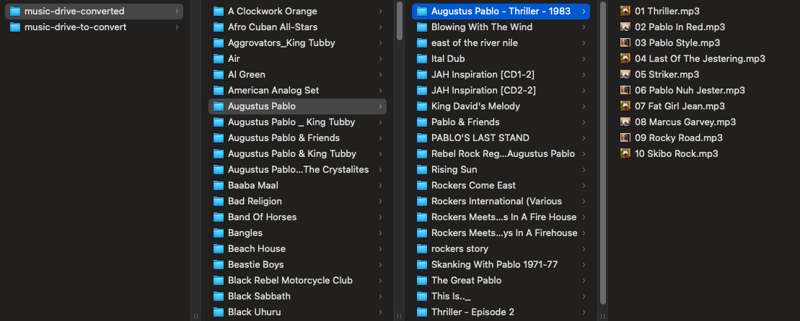

# Convert Music Library

Convert an iTunes (or other) music library from `.m4a` to `.mp3` (or `.wav`) maintaining original directory structure (`Artist/Album/Song`)

```bash
# install ffmpeg
brew install ffmpeg
# clone repo
clone https://github.com/omundy/convert-music-library.git
# install
npm i
# run
node index.js
# test
nodemon index.js
```

See also https://github.com/omundy/ffmpeg-examples

